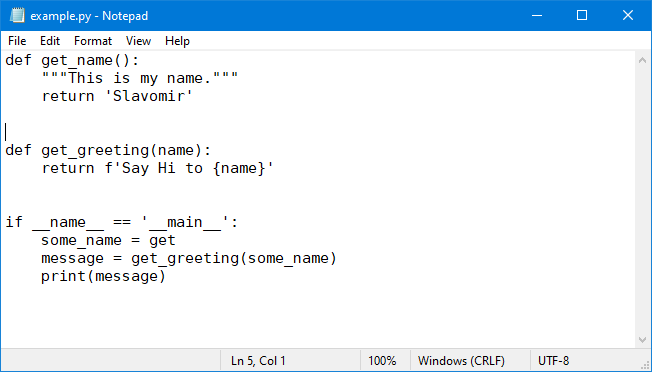
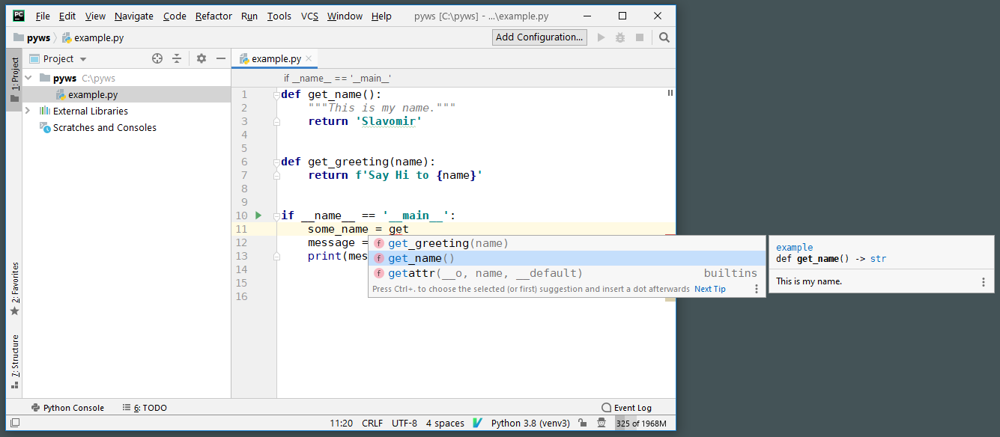
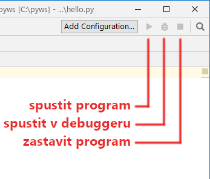
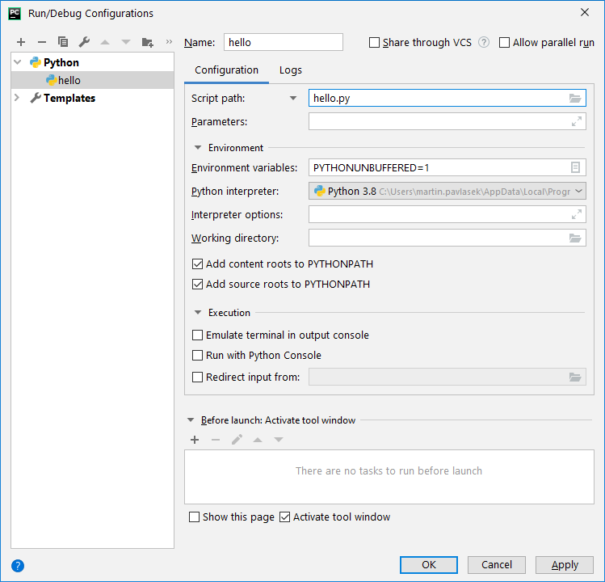

# Pycharm zlehka

## Textový editor vs vývojové prostředí
Programů, ve kterých se dá psát text je spousta. Poznámkový blok, MS Word...
ty se však pro programování nehodí, viz níže.

## Textový editor
... je program, ve kterém se dá psát holý text, tj. bez formátování.
Porovnejte si ten samý kus kódu z Poznámkového bloku s PyCharmem níže.
Do této kategorie patří i např. PSPad.

## Vývojové prostředí (IDE)
... je sofistikovaný textový editor, který napomáhá uživateli s vývojem programu.
* zvýrazňuje klíčová slova (syntaxi),
* našeptává konstrukce relevantní pro to místo,
* zobrazuje dokumentaci k funkcím
* upozorňuje na syntaktické chyby
* umožňuje pozastavit běžící program a sledovat aktuální hodnoty proměnných (debugging)

### PyCharm

PyCharm (Community edition stačí, [stahujte zde](https://www.jetbrains.com/pycharm/download/))
je aktuálně jeden z nejlepších nástrojů pro vývoj v Pythonu.

Nabízí spoustu užitečných funkcí, ale z počátku si vystačíme
jen se založením projektu a ukážeme si, jak se v něm spouští programy.

#### Nový projekt

Projekt je souhrn složek (může jich být totiž více - dají se přidat kdykoli
později), kde jsou uloženy tvé zdrojové soubory.

* Soubor - Nový projekt - 

  **Umístění** - to je Rodičovský adresář se zdrojovými soubory.
  Můžeš klidně použít i existující. Buť bez obav, PyCharm ti nic nesmaže.
  Pouze do ní vytoří složku ".idea",
kde si ukládá nastavení projektu.

  **Interpret** - Existující interpret (vybrat z roletky)

V levé části najdeš stromovou strukturu se zdrojovými soubory. Nový se vytvoří
tradičně pravým kliknutím myši na složku, do které chceš soubor založit,
vybrat Nový - Python file.

#### Spuštění programu

Program můžeš nechat běhat klidně i bokem v příkazové řádce, nicméně pak nemáš
možnost využít vestavěného debuggeru.

Po založení projektu je třeba ještě nastavit konfiguraci pro spuštění
(pravý horní roh okna).

Klikneme na **Přidat konfiguraci**, v novém okně na ikonku se symbolem "**+**" -
**Python**.

Nejdříve vyplníme cestu k souboru (`Script path`), který chceme spustit
(vč. přípony). Tím se nám předvyplní i popiska konfigurace, ponecháme ji tam.

Nyní již můžeme program spustit.

Jediný rozdíl mezi akcemi *Spustit* a *Spustit v debuggeru* je ten, že *Spustit*
nebere v potaz zarážky v programu (tzv. breakpointy), takže i když se program
vykonává v místě breakpointu, nezastaví se.
